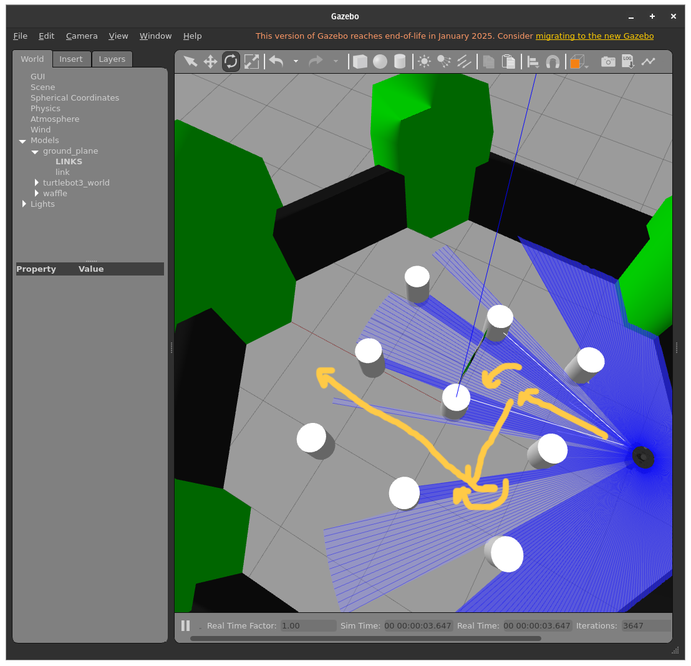
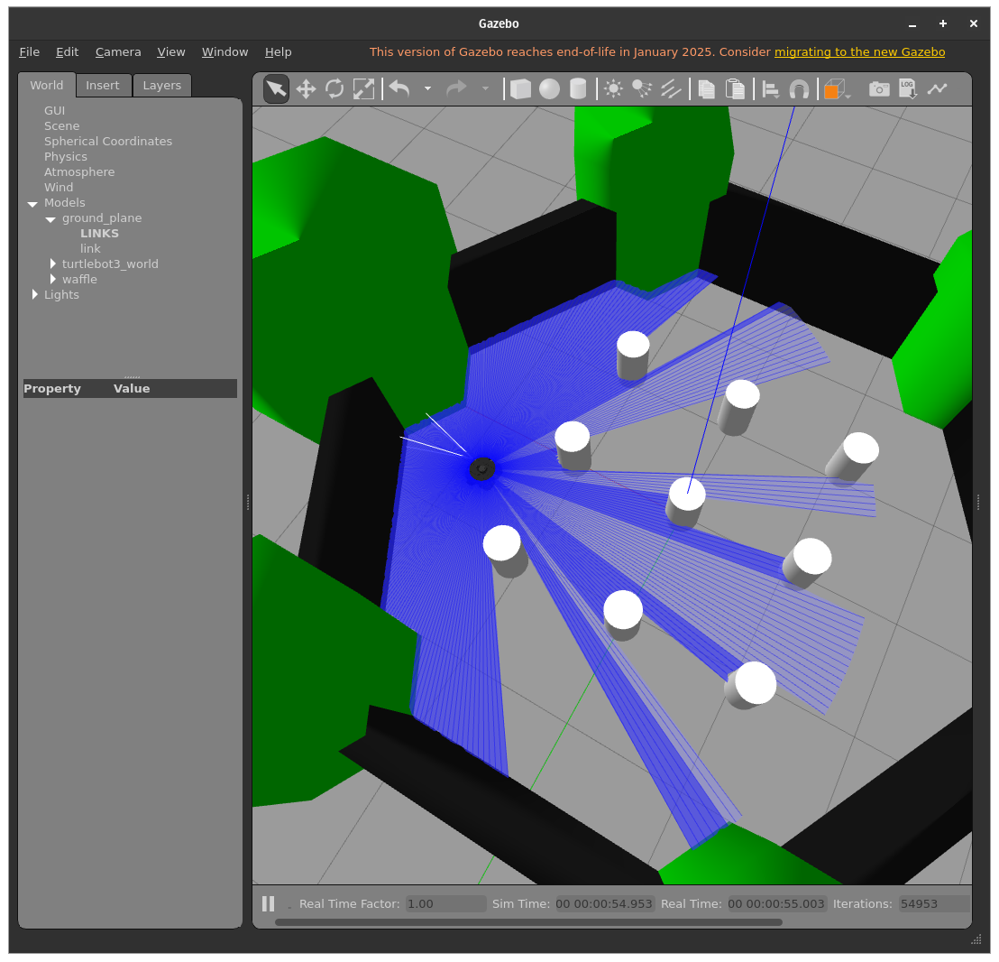

# **Ros2 & Gazebo movement**

This repo performs publishing a velocity under "/cmd_vel" topic to Gazebo and with that follow predefined path.

---

### **How to Run**

```bash
    export TURTLEBOT3_MODEL=waffle
    source /opt/ros/humble/setup.bash
    source /usr/share/colcon_argcomplete/hook/colcon-argcomplete.bash

    source /workSpacePath/install/setup.bash # or locate workspace and run below code
    # source /install/setup.bash
    ros2 launch turtlebot3_gazebo turtlebot3_world.launch.py
```

to another terminal

```bash
    ros2 run move_robot move_forward
```

---

### **Important Notes**

* If you cannot run please contact to me.

---

### **Predefined Path**



Final view



---
